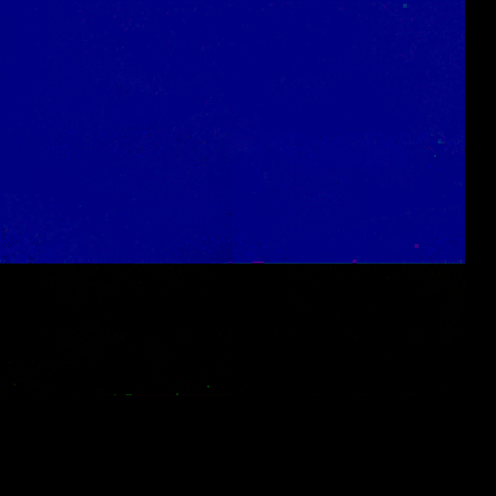
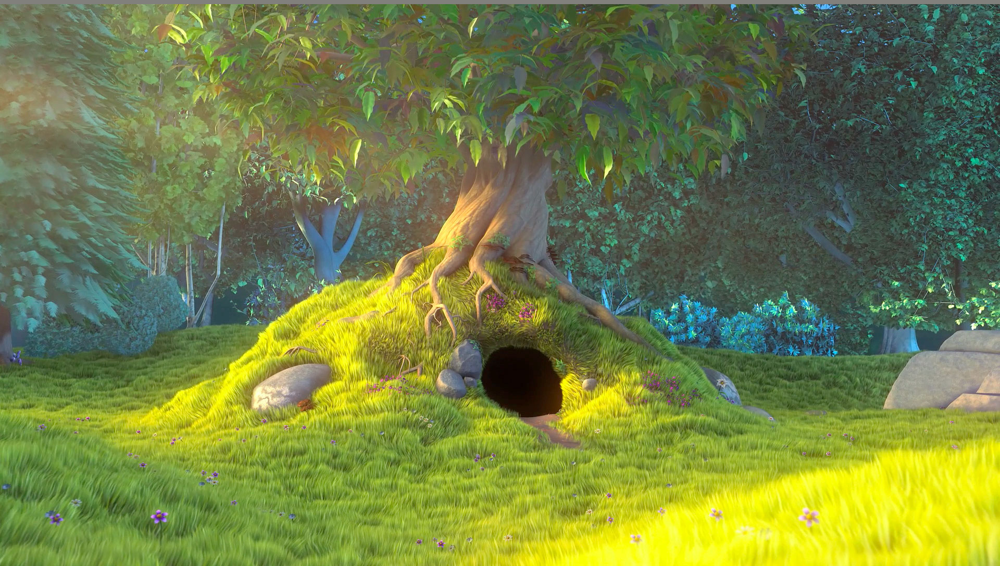
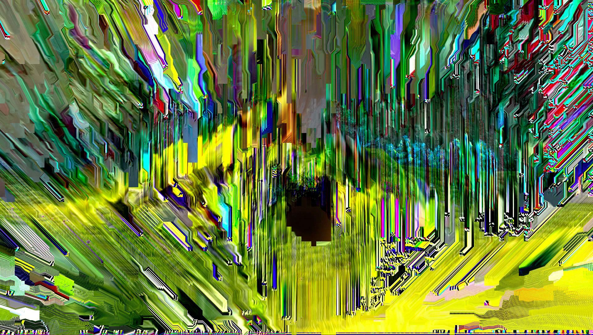

# rdm-png

### Decoding a delta frame at 120 fps using WebGL.
### [demo](https://mizt.github.io/rdm-png/)

###### using [Big Buck Bunny](https://peach.blender.org/trailer-page/) as the source material.

### First frame

### Delta frame data

### First decoded frame

### 128 times decoded frame

